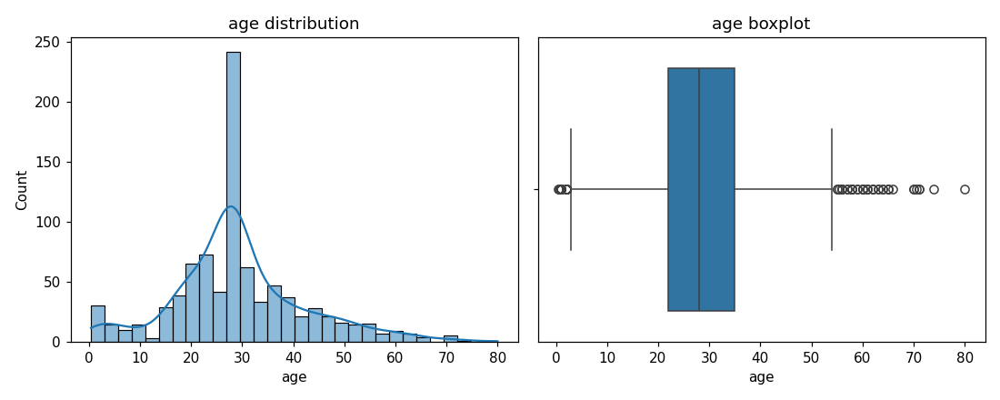
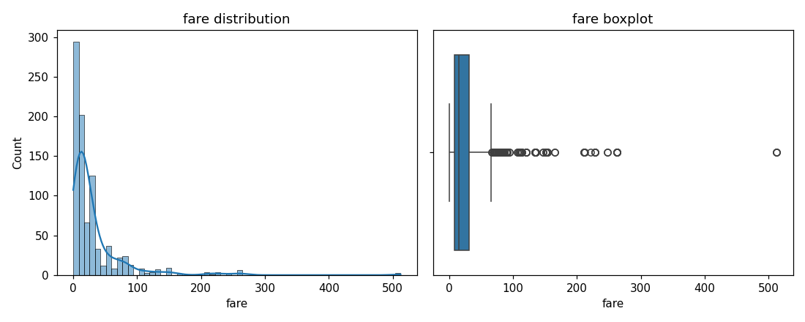
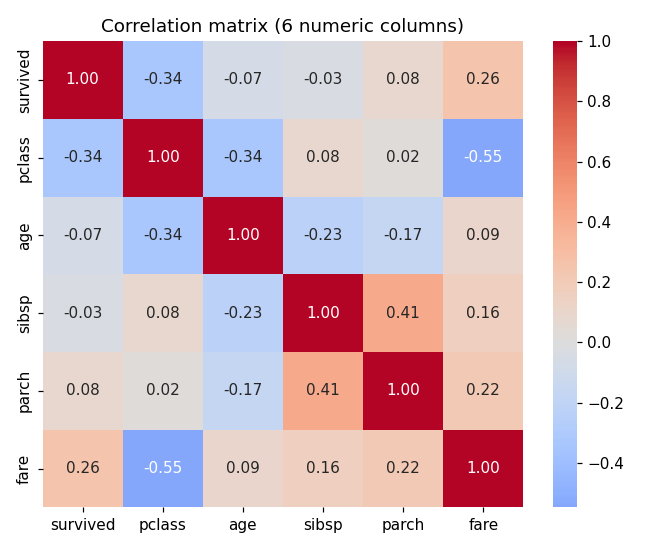
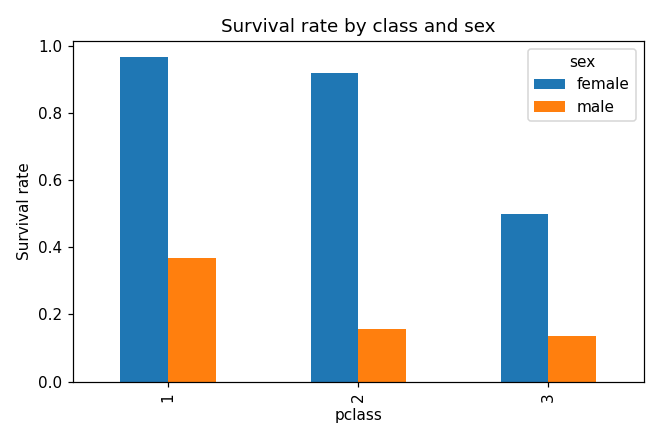
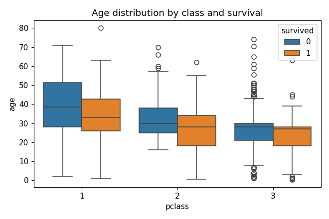
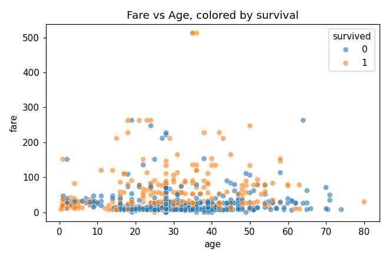
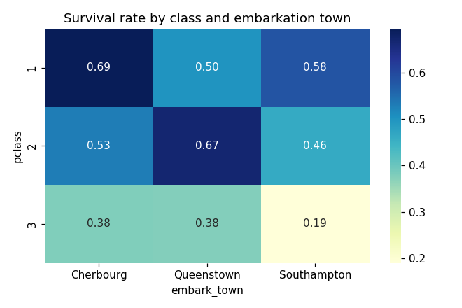

# Module 2 -- EDA Report

## Task 1 -- Profiling

Shape: (891, 15)

```
<class 'pandas.DataFrame'>
RangeIndex: 891 entries, 0 to 890
Data columns (total 15 columns):
 #   Column       Non-Null Count  Dtype   
---  ------       --------------  -----   
 0   survived     891 non-null    int64   
 1   pclass       891 non-null    int64   
 2   sex          891 non-null    str     
 3   age          714 non-null    float64 
 4   sibsp        891 non-null    int64   
 5   parch        891 non-null    int64   
 6   fare         891 non-null    float64 
 7   embarked     889 non-null    str     
 8   class        891 non-null    category
 9   who          891 non-null    str     
 10  adult_male   891 non-null    bool    
 11  deck         203 non-null    category
 12  embark_town  889 non-null    str     
 13  alive        891 non-null    str     
 14  alone        891 non-null    bool    
dtypes: bool(2), category(2), float64(2), int64(4), str(5)
memory usage: 80.7 KB

```

Describe (numeric):

```
         survived      pclass         age       sibsp       parch        fare
count  891.000000  891.000000  714.000000  891.000000  891.000000  891.000000
mean     0.383838    2.308642   29.699118    0.523008    0.381594   32.204208
std      0.486592    0.836071   14.526497    1.102743    0.806057   49.693429
min      0.000000    1.000000    0.420000    0.000000    0.000000    0.000000
25%      0.000000    2.000000   20.125000    0.000000    0.000000    7.910400
50%      0.000000    3.000000   28.000000    0.000000    0.000000   14.454200
75%      1.000000    3.000000   38.000000    1.000000    0.000000   31.000000
max      1.000000    3.000000   80.000000    8.000000    6.000000  512.329200
```

**Percentage missing per column (only columns with any missing):**

```
deck           77.22
age            19.87
embarked        0.22
embark_town     0.22
```

## Task 2 -- Missing value handling (threshold rule: <5% drop rows, 5-30% impute, >=30% drop column or encode 'missing')

- `deck`: 77.22% missing (>=30%) -> **dropped the column** (too sparse to impute reliably; not used downstream).
- `age`: 19.87% missing (5-30%) -> **imputed with median** (28.00).
- `embarked`: 0.22% missing (<5%) -> **dropped rows** (2 rows removed).
- `embark_town`: 0.22% missing (<5%) -> **dropped rows** (0 rows removed).

## Task 3 -- Univariate analysis

- `age`: **65 IQR outliers**. 
- `fare`: **114 IQR outliers**. 

`fare` -- mean=32.10, median=14.45, mode=8.05. Since mean > median > mode, the distribution is **right-skewed**: a long tail of a few very expensive fares pulls the mean above the median, while most passengers cluster at cheap fares near the mode.

## Task 4 -- Bivariate analysis

**Survival rate by sex:**
```
sex
female    0.740
male      0.189
```

**Survival rate by pclass:**
```
pclass
1    0.626
2    0.473
3    0.242
```

**Survival rate by sex AND pclass (boolean masking):**
```
   sex  pclass  survival_rate
  male       1          0.369
  male       2          0.157
  male       3          0.135
female       1          0.967
female       2          0.921
female       3          0.500
```



**Two strongest correlations (by absolute off-diagonal value):**

- `pclass` & `fare`: r = -0.548 (negative).
- `sibsp` & `parch`: r = 0.415 (positive).

## Task 5 -- Multivariate data story

**Chart 1 (bar):** 

Survival rate is highest for women in 1st and 2nd class (well above 90%), and lowest for men in 3rd class (under 15%). Sex is the dominant factor, but class compounds it heavily -- 3rd class women still survive at roughly double the rate of 1st class men. This matches the historical 'women and children first' boarding norm, moderated by which deck/class had faster access to lifeboats.

**Chart 2 (box):** 

Median age climbs from 3rd to 1st class regardless of survival outcome, reflecting that wealthier, older passengers could afford higher-class tickets. Within each class, survivors skew only slightly younger than non-survivors -- age matters, but far less than class or sex do on their own.

**Chart 3 (scatter):** 

Survivors (orange) are noticeably denser at higher fares across all ages, while non-survivors cluster at low fares. There's no strong age trend within either group -- fare (a proxy for class/wealth) separates survival outcomes far more cleanly than age does on a scatter plot.

**Chart 4 (heatmap):** 

Cherbourg passengers survive at a noticeably higher rate within every class than Southampton or Queenstown passengers do -- likely because Cherbourg boarders skewed more heavily toward 1st class generally. Southampton 3rd class, the largest and poorest group aboard, has the lowest survival rate of any cell in this grid.

## Task 6 -- Exploratory standardization check (EDA-stage only)

- `age`: before -> mean=29.315, std=12.985; after z-score -> mean=0.000, std=1.000 (approximately 0 and 1, as expected).
- `fare`: before -> mean=32.097, std=49.698; after z-score -> mean=0.000, std=1.000 (approximately 0 and 1, as expected).

This is purely a sanity check on the cleaned EDA data. It does **not** feed into the modeling pipeline in Part B, which performs its own train-only `StandardScaler` fit as part of Task 8.
