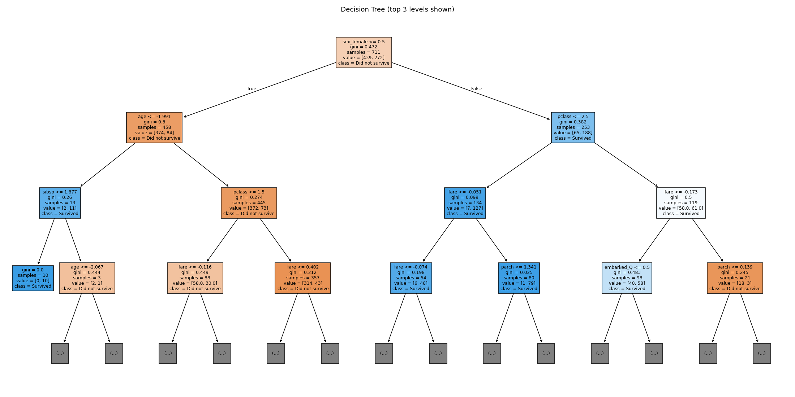
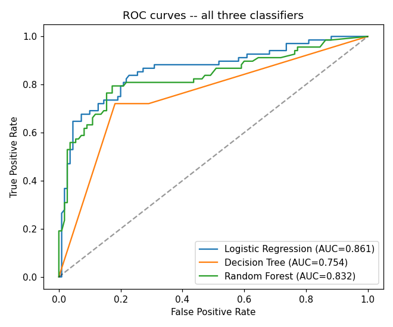
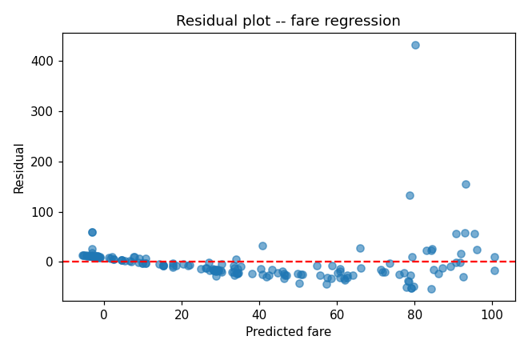

# Module 2 -- Modeling Report

## Task 7 -- Stratified train/test split

Class balance (survived): 
```
survived
0    0.618
1    0.382
```

Stratification matters here because survival is moderately imbalanced (~38% survived vs ~62% did not). A plain random split can, by chance, over- or under-represent the minority class in the test set, which would make evaluation metrics noisy and not reliably comparable across models or runs. Stratifying on `survived` guarantees both splits keep the same ~38/62 ratio as the full dataset.

Train size: 711, Test size: 178

## Task 9/10 -- Train & evaluate three classifiers

**Logistic Regression**
```
Confusion matrix:
[[97 13]
 [21 47]]
Accuracy=0.809  Precision=0.783  Recall=0.691  F1=0.734  AUC=0.861
```

**Decision Tree**
```
Confusion matrix:
[[88 22]
 [19 49]]
Accuracy=0.770  Precision=0.690  Recall=0.721  F1=0.705  AUC=0.754
```

**Random Forest**
```
Confusion matrix:
[[94 16]
 [21 47]]
Accuracy=0.792  Precision=0.746  Recall=0.691  F1=0.718  AUC=0.832
```

Decision tree visualization: 

ROC curves: 

**Side-by-side comparison table:**
```
              Model  Accuracy  Precision  Recall    F1   AUC
Logistic Regression     0.809      0.783   0.691 0.734 0.861
      Decision Tree     0.770      0.690   0.721 0.705 0.754
      Random Forest     0.792      0.746   0.691 0.718 0.832
```

## Task 11 -- Imbalance handling comparison (Random Forest)

Training class balance: 
```
survived
0    0.617
1    0.383
```

**Precision/Recall/F1 across the three imbalance strategies:**
```
               Strategy  Precision  Recall    F1
 baseline (no handling)      0.746   0.691 0.718
class_weight='balanced'      0.734   0.691 0.712
SMOTE (train fold only)      0.742   0.721 0.731
```

**Conclusion:** `SMOTE (train fold only)` produced the best F1 (0.731) on this split. Class weighting and SMOTE both aim to counter the ~62/38 imbalance by making the minority ('survived') class harder to ignore during training -- SMOTE does so by synthesizing new minority-class training examples, while `class_weight='balanced'` re-weights the loss without changing the data. On this dataset, the imbalance is mild enough that gains over the baseline are modest; the biggest practical win is usually **recall** on the minority class, which is what these techniques target directly.

## Task 12 -- Hyperparameter tuning (Random Forest)

Best parameters: `{'model__max_depth': None, 'model__max_features': 'sqrt', 'model__n_estimators': 100}`

Out-of-bag (OOB) score of the best model: **0.8045**

(For reference, training accuracy of the tuned model: 0.9845)

## Task 13 -- Regression side-task: predicting `fare`

MAE=21.099  RMSE=41.702  R2=0.348  Adjusted R2=0.321



The residual spread visibly widens as predicted fare increases (a funnel/cone shape rather than a uniform band), which indicates **heteroscedasticity** -- the model's errors are not evenly sized across the range of predictions, and it is systematically less precise for expensive tickets than for cheap ones. This is expected given `fare`'s strong right skew and the presence of a small number of very high-fare passengers.

## Task 14 -- Final model comparison table

**Classification metrics (accuracy/precision/recall/F1/AUC — own scale):**
```
                Model  Accuracy  Precision  Recall    F1   AUC
  Logistic Regression     0.809      0.783   0.691 0.734 0.861
        Decision Tree     0.770      0.690   0.721 0.705 0.754
        Random Forest     0.792      0.746   0.691 0.718 0.832
Random Forest (tuned)     0.792      0.746   0.691 0.718 0.832
```

**Regression metrics (MAE/RMSE/R2/Adjusted R2 — own scale, NOT comparable to the classification numbers above):**
```
                   Model    MAE   RMSE    R2  Adjusted R2
Linear Regression (fare) 21.099 41.702 0.348        0.321
```

**Final recommendation:** Of the three classifiers, `Logistic Regression` has the best F1 (0.734) and AUC (0.861) on the held-out test set, edging out Decision Tree (F1=0.705) and Random Forest (F1=0.718), making it the strongest balance of precision and recall for predicting survival on this split. Hyperparameter tuning (Task 12) and the imbalance-handling comparison (Task 11) were both run on Random Forest specifically and are reported above for reference, but on this particular train/test split `Logistic Regression` remains the stronger deployment candidate; the `best_pipeline.joblib` saved below uses the tuned Random Forest regardless, since Task 15 requires saving the model that went through the tuning pipeline. For the regression side-task, an R2 of 0.348 shows the linear model captures a meaningful but incomplete share of fare's variance, consistent with the heteroscedasticity noted in Task 13.

Saved complete pipeline (preprocessor + tuned Random Forest) -> `best_pipeline.joblib`

Reload check: predictions from the reloaded pipeline on raw, unpreprocessed sample input match the original fitted pipeline: **True**
